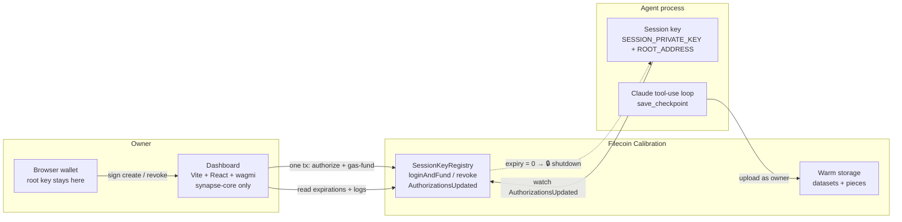

# FilAgentKey 🔑

**Valet keys for AI agents on Filecoin.**

You wouldn't give a valet your house keys. Why does your AI agent hold your
root wallet key?

FilAgentKey lets an owner mint a **scoped, time-limited, on-chain-revocable
session key** from a web dashboard. An AI agent holding *only* that key (plus
the owner's public address) stores data on Filecoin **under the owner's
identity** — and the moment the owner clicks **Revoke**, the agent is locked
out live, mid-run. The root key never leaves the owner's browser wallet.

Built on [Filecoin Onchain Cloud](https://docs.filecoin.cloud) (Synapse SDK +
session-key registry) for the tool / adapter / developer-utility track.
Calibration testnet.

## Why

Agents need standing credentials to do real work, but a root key in an
agent's env file is a time bomb: unlimited scope, unlimited lifetime, no kill
switch. FilAgentKey demonstrates the alternative that Filecoin's on-chain
SessionKeyRegistry makes possible:

| Root key in agent's env | FilAgentKey valet key |
| --- | --- |
| Full account control | One permission: `AddPieces` (store data, nothing else) |
| Lives forever | Expires on-chain (15 min / 1 h / 24 h) |
| Rotation = manual panic | One **Revoke** click; agent locked out in seconds |
| Compromise = game over | Blast radius: gas dust + storage writes until revoked |

No backend, no database: **chain state is the only source of truth.** The
dashboard reads live key status from `getExpirations()` and history from
`AuthorizationsUpdated` event logs; the agent watches the same events and
shuts itself down when its authorization is zeroed.

## Architecture



- **Dashboard** (`dashboard/`): connect wallet → create key (client-side
  keypair, permission checkboxes, expiry presets) → one `loginAndFund`
  transaction authorizes the key and funds its gas → **one-time reveal** of
  the agent env block → live key cards with per-permission countdowns +
  activity feed → **Revoke**.
- **Agent** (`agent/`): boots from two env vars. Prints its permission scope
  (`AddPieces ✓ / CreateDataSet ✗`), then runs a minimal Anthropic tool-use
  loop — Claude writes field notes and persists each one to Filecoin through
  a single `save_checkpoint` tool. A watcher on the registry kills the
  process the moment the key is revoked or expires. `--plain` runs the same
  upload loop without the LLM.

## Quickstart

Prerequisites: Node 20+, pnpm, MetaMask. One-time wallet setup on
[Calibration](https://docs.filecoin.io/networks/calibration): tFIL from the
[faucet](https://faucet.calibnet.chainsafe-fil.io/), a USDFC deposit, and
warm-storage operator approval (see the
[Filecoin Onchain Cloud docs](https://docs.filecoin.cloud)).

```bash
pnpm install
```

**1. Dashboard (owner side)**

```bash
pnpm dev          # then open the printed URL
```

Connect the funded wallet → **Create agent key** (defaults: AddPieces only,
15 min) → confirm in MetaMask → copy the revealed env block. It is shown
once and never stored.

**2. Agent (valet side)**

```bash
cd agent
cp .env.example .env    # paste SESSION_PRIVATE_KEY + ROOT_ADDRESS from the reveal,
                        # plus ANTHROPIC_API_KEY for the Claude demo mode
pnpm agent              # Claude field-notes agent (or: pnpm agent:plain)
```

**3. The kill switch**

Click **Revoke** on the key card. Within ~30–60 s (one 30 s Filecoin epoch +
event poll) the agent prints
`🔒 SESSION KEY REVOKED ON-CHAIN — access lost, shutting down.` and exits.
Any restart fails the permission check.

Handy: `npx tsx --env-file=.env check-status.mts` (in `agent/`) prints live
balances and per-permission authorization state for the key in `.env`.

## 90-second demo script

Prep (before recording): wallet connected on the dashboard, MetaMask already
on Calibration, `agent/.env` filled except `SESSION_PRIVATE_KEY`, terminal
side-by-side with the browser, one full rehearsal done. Uploads take ~2 min
on Calibration — record continuously and jump-cut the wait; every PieceCID
on screen is real.

| Time | Shot | Action / line |
| --- | --- | --- |
| 0:00–0:10 | Dashboard | "This is my Filecoin storage account. I want an AI agent to use it — without ever holding my keys." |
| 0:10–0:30 | Dashboard | Create agent key → AddPieces only, 15 min → MetaMask confirm → reveal screen. "One transaction mints a valet key: one permission, 15 minutes, revocable. Shown once, never stored." Paste `SESSION_PRIVATE_KEY` into `agent/.env`, click *I've saved it*. |
| 0:30–0:50 | Terminal | `pnpm agent`. Point at the boot lines: "The agent gets two env vars — a session key and my *public* address. It can add data ✓, it cannot touch my account ✗." Claude starts entry 1, `[1] uploading checkpoint…` |
| 0:50–1:00 | *(jump cut)* Terminal + dashboard | `[1] stored ✓ PieceCID: bafk…` — "Stored on Filecoin, under my identity, billed to my account." Dashboard: card counting down, activity feed shows the authorization. |
| 1:00–1:10 | Dashboard | Click **Revoke** → MetaMask confirm → badge flips to red *revoked*. "Now the kill switch." |
| 1:10–1:25 | Terminal | Claude is mid-entry when `🔒 SESSION KEY REVOKED ON-CHAIN — access lost, shutting down.` lands. "Seconds after the transaction, the agent is out — mid-thought." |
| 1:25–1:30 | Terminal | Re-run `pnpm agent` → `AddPieces ✗` → exits. "Locked out for good. Root key never left my wallet. That's FilAgentKey." |

Fallbacks while recording: an SP timeout makes Claude retry (still a good
shot); `pnpm agent:plain` runs the loop without the LLM if the API
misbehaves.

## Repo layout

| Path | What |
| --- | --- |
| `dashboard/` | Owner dashboard — Vite + React + wagmi + `@filoz/synapse-core` (never the full SDK; enforced by pnpm's strict `node_modules`) |
| `agent/` | Demo agent — Node + tsx + full `@filoz/synapse-sdk` + `@anthropic-ai/sdk` |
| `spike/` | Stage 0 reference scripts (ground truth for API usage) |
| `specs/` | Per-stage specs, acceptance checks, and API deviations discovered from source |

## Known limitations (testnet honesty)

- Calibration RPC caps `eth_getLogs` at 2880 epochs, so each key's storage
  audit trail covers roughly the last 24 h. Registry history already observed
  by this browser may persist in its public local cache; live status via
  `getExpirations` is unaffected.
- Plain value transfers emit no contract log, so gas top-ups and `--sweep`
  returns do not appear in the audit trail.
- Storage actions submitted through the standard `addPieces` flow are
  attributed by recovering its EIP-712 signer. Dataset-creation and
  non-standard submissions remain visible as unattributed dataset actions.
- Calibration storage providers are flaky: uploads take ~2 min and
  occasionally time out on-chain commits. The agent surfaces failures to
  Claude as retryable tool results.
- The session key needs a little tFIL for gas — `loginAndFund` covers that
  in the same transaction that authorizes it (0.3 tFIL).
